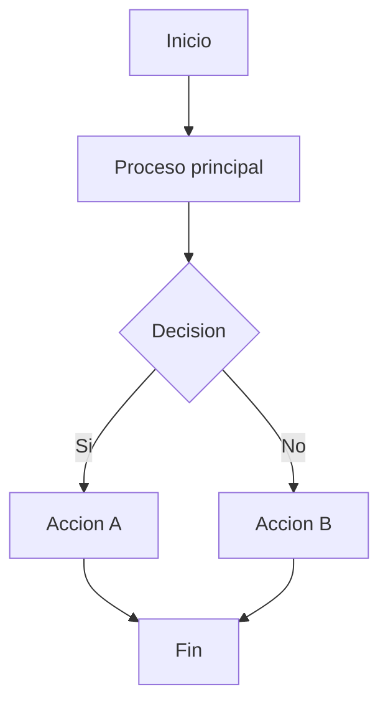
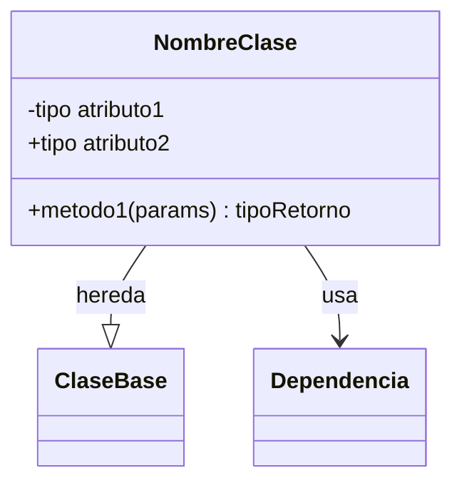
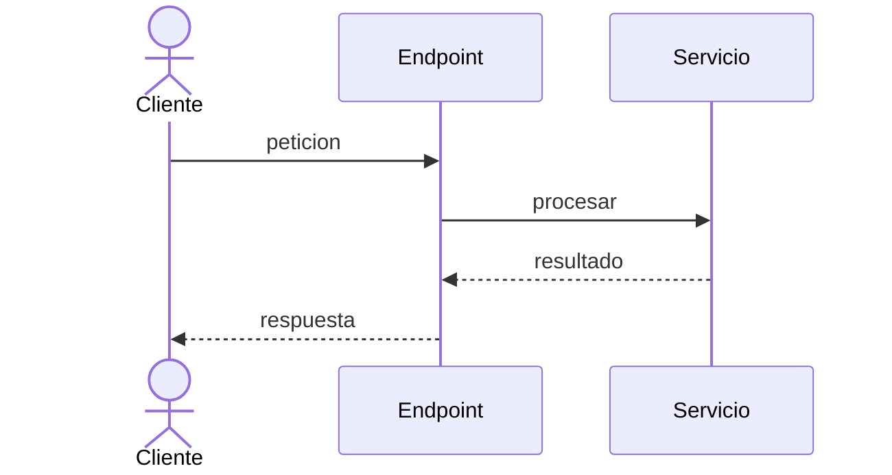
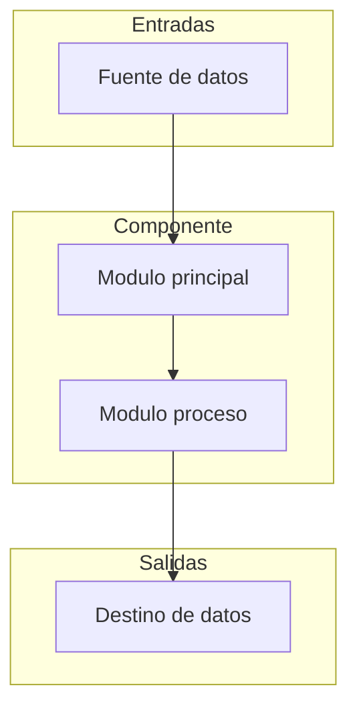

# Estándares Mermaid

Skill de validación y estándares para diagramas Mermaid en documentación de cualquier dominio.

## Flujo de validación obligatorio

Antes de emitir cualquier diagrama Mermaid:
1. Validar sintaxis mentalmente siguiendo la checklist (sección abajo)
2. Solo si no hay errores, emitir con marca previa: `<!-- Diagrama validado: ✅ -->`
3. Si hay errores no corregibles → aplicar fallback textual

## Caracteres prohibidos en labels

Los siguientes caracteres están **prohibidos** dentro del texto de nodos, flechas y subgraphs:

| Carácter | Problema |
|----------|----------|
| `?` | Rompe parser |
| `:` | Confunde sintaxis de clases |
| `"` | Rompe delimitadores |
| `'` | Rompe delimitadores |
| `(` | Confunde formas de nodos |
| `)` | Confunde formas de nodos |
| `\n` | Salto de línea no soportado |

**Solución**: reformular el texto para evitar estos caracteres.

## Identificadores de nodos

- Solo letras, números, guiones bajos y guiones
- camelCase o kebab-case: `evalEstado`, `fin-proceso`, `A1`
- Sin espacios
- Para labels visibles, usar corchetes: `A1[Texto legible del nodo]`

## Límites de complejidad

| Tipo de diagrama | Límite |
|-----------------|--------|
| flowchart | ≤ 12 nodos (≤ 25 si es flujo completo funcional) |
| classDiagram | ≤ 12 clases |
| sequenceDiagram | ≤ 6 participantes, ≤ 16 mensajes |

- Profundidad recomendada: 3 niveles
- Evitar subgraph anidados profundos
- Si un diagrama excede límites: dividir en subdiagramas o subir nivel de abstracción

## Orientación

- **Obligatorio**: `flowchart TD` (vertical top-down)
- **Prohibido**: `flowchart LR` (horizontal causa scroll)

## Paleta de colores estándar

```
classDef dominio         fill:#1f77b4, stroke:#1b4f72, color:#ffffff
classDef aplicacion      fill:#2ca02c, stroke:#1d6f1a, color:#ffffff
classDef infraestructura fill:#9467bd, stroke:#5b2c6f, color:#ffffff
classDef externo         fill:#ff7f0e, stroke:#7f3b00, color:#000000
```

Para diagramas de clase específicos:
- **Azul (#3b82f6)**: Clase principal / nodo inicial
- **Verde (#10b981)**: GET/consulta / nodos finales exitosos
- **Naranja (#f59e0b)**: POST/creación / procesos
- **Morado (#8b5cf6)**: PUT/actualización
- **Rojo (#ef4444)**: DELETE/eliminación / errores
- **Cian (#06b6d4)**: Dependencias externas

## Plantillas canónicas

### flowchart



### classDiagram



### sequenceDiagram



## Checklist de verificación post-generación (7 pasos)

Aplicar a CADA bloque Mermaid antes de incluirlo:

1. **IDs alfanuméricos**: ¿Todos los nodos usan IDs sin espacios? (camelCase o guiones)
2. **Labels limpios**: ¿Ningún label contiene `:` `?` `"` `'` `(` `)` `\n`?
3. **Flechas válidas**: ¿Cada `-->|texto|` tiene texto limpio entre barras?
4. **Subgraph limpio**: ¿Sin comillas ni caracteres especiales en títulos?
5. **Estructura parseable**: ¿Se lee top-to-bottom sin nodos huérfanos ni flechas rotas?
6. **Corrección**: Si falla algún punto → corregir ANTES de incluir
7. **Fallback**: Si no es corregible → sustituir por fallback

## Validación de marca

Incluir como comentario HTML previo a cada diagrama válido:
```html
<!-- Diagrama validado: ✅ -->
```

## Fallback obligatorio

Si tras corrección no valida:

```text
MERMAID_FALLBACK
Resumen: [descripción breve del flujo o relación]
Razón: [error de Mermaid y límite infringido]
Acción: [propuesta de simplificación]
```

En HTML, sustituir por:
```html
<div class="alert alert-warning">Diagrama: NO DISPONIBLE — no se pudo generar un diagrama fiable con la información disponible.</div>
```

## Reglas por contexto

### Diagramas funcionales

- Solo lenguaje funcional de negocio
- **Prohibido**: instrucciones técnicas de implementación (SQL, llamadas API, nombres de funciones internas)
- Nodos = acciones de negocio: "Buscar elemento", "Evaluar estado", "Notificar usuario"
- Decisiones = condiciones de negocio, no de código

### Diagramas técnicos

- Usar nombres literales de funciones/componentes/métodos tal como aparecen en el código
- Aristas = invocaciones o dependencias literales
- Etiquetas de corte: condiciones literales del código
- Prohibido inventar resúmenes semánticos sin evidencia literal

### Diagrama de arquitectura



## Accesibilidad

- Contraste adecuado con la paleta dada (AA o superior)
- Etiquetas concisas
- Párrafo adyacente describiendo el diagrama cuando sea necesario
- Texto alternativo textual siempre disponible como fallback
